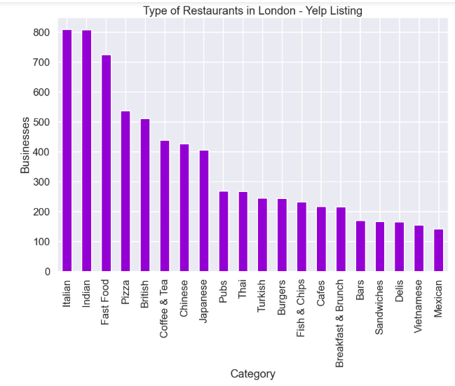
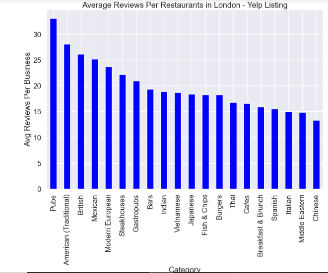
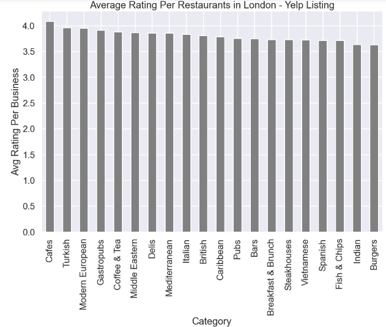
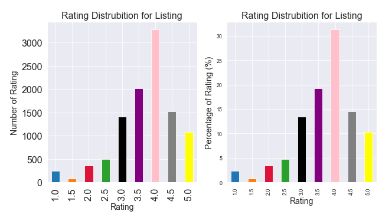
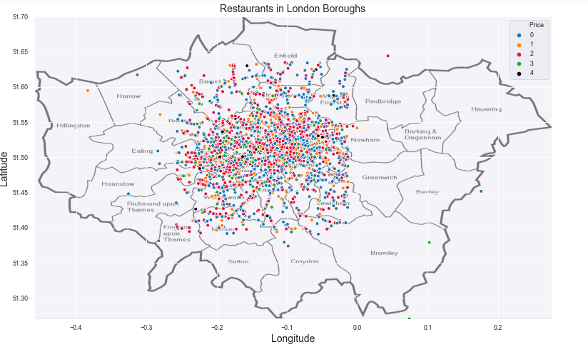
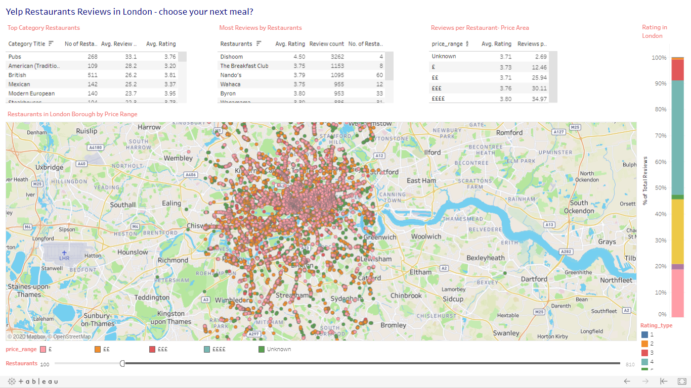

# Yelp Restaurants Reviews: Data Analysis Project
I used yelp API to gather all the restaurants listing across London (within radius of 25km) and used python to analysis the data.

# Code and Resources Used

**Python Version**: 3.7

**Packages**: pandas, numpy, sklearn, matplotlib, seaborn,json, pickle

**Scraper Resource**: https://stackoverflow.com/questions/60012952/how-to-code-a-for-loop-in-python-for-a-web-scraper

# 1. API 
# 2. Data Cleaning

After downloading the data, I needed to clean it up so that it was usable for our analysis. I had to deal with missing values some of them were dealt manually and other such as missing postcode I filled in the missing values with London central postcode because it was irrelevant to our analysis.

- Changing the Price column to object type and replacing the values from (Unknown,£,££,£££,££££) to (0,1,2,3,4) as it states the price of the restaurants. 

# 3. EDA

# [ 4. Tableau Public](https://public.tableau.com/profile/jas2719#!/vizhome/restuarants_yelp/YELP)

