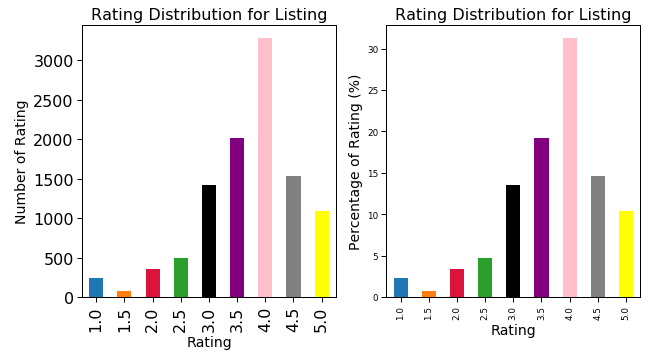

# Yelp Restaurants Reviews: Data Analysis Project
I used yelp API to gather all the restaurants listing across London (within radius of 25km) and used python to analysis the data.

# Code and Resources Used

**Python Version**: 3.7

**Packages**: pandas, numpy, sklearn, matplotlib, seaborn,json, pickle

**Scraper Resource**: https://stackoverflow.com/questions/60012952/how-to-code-a-for-loop-in-python-for-a-web-scraper

# 1. API 
# 2. Data Cleaning

After downloading the data, I needed to clean it up so that it was usable for our analysis. I had to deal with missing values some of them were dealt manually and other such as missing postcode I filled in the missing values with London central postcode because it was irrelevant to our analysis.

- Changing the Price column to object type and replacing the values from (Unknown,£,££,£££,££££) to (0,1,2,3,4) as it states the price of the restaurants. 

# 3. EDA

# Insight
- There are 800+ Italian and Indian restaurants across London and there are 179 different categories of restaurants. London is known for its multi culture food in the UK and there are 29 different type of categories with more than 100 restaurants.

- Pubs and American Restaurants tend to get the most reviews. On Average each pub in London tend to get 30+ reviews.

- Only cafes have a rating of 4 stars across London. Chinese and American restaurant tend to have the worst rating.

- Chain restaurants tends to get the most reviews compare to other restaurants this could be due to their popularity.

- 31% of the ratings are 4 stars and 90% of Rating is 3 stars or above, this shows customers tend to enjoy their experiences at these restaurants.

- City,Westminster and Kensington & Chelsea has the most high end restaurants, which kind of make sense as MPs and high paying jobs can be found in these boroughs.

- Expensive Restaurants does tend to get more reviews however when it comes to rating and compare across other price range restaurants, we cannot say with confidence that expensive restaurants receive better rating.

# [ 4. Tableau Public](https://public.tableau.com/profile/jas2719#!/vizhome/restuarants_yelp/YELP)

